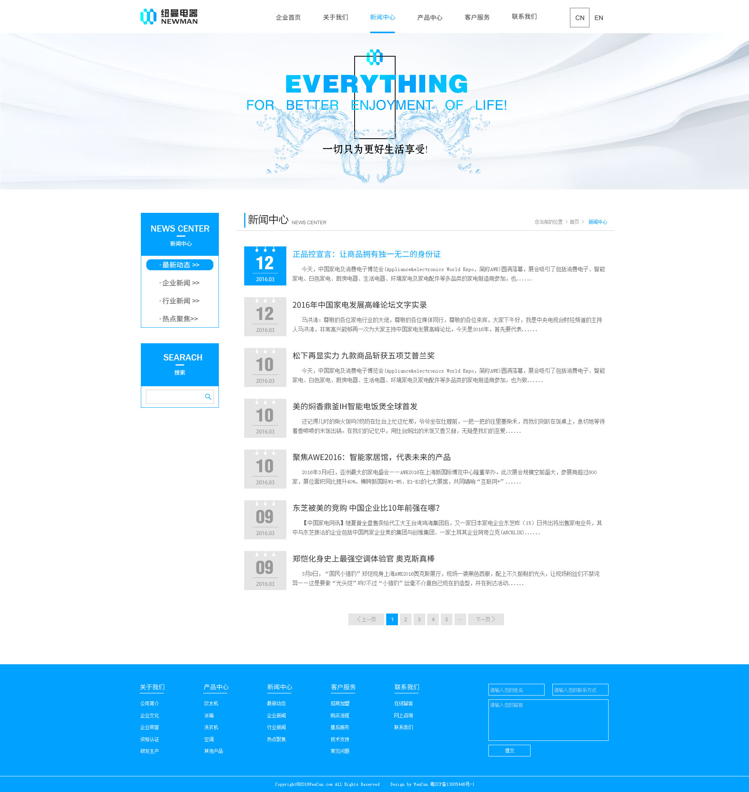
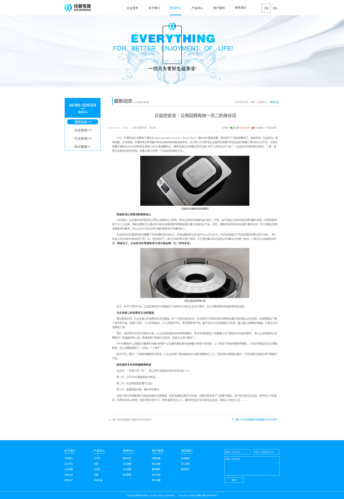
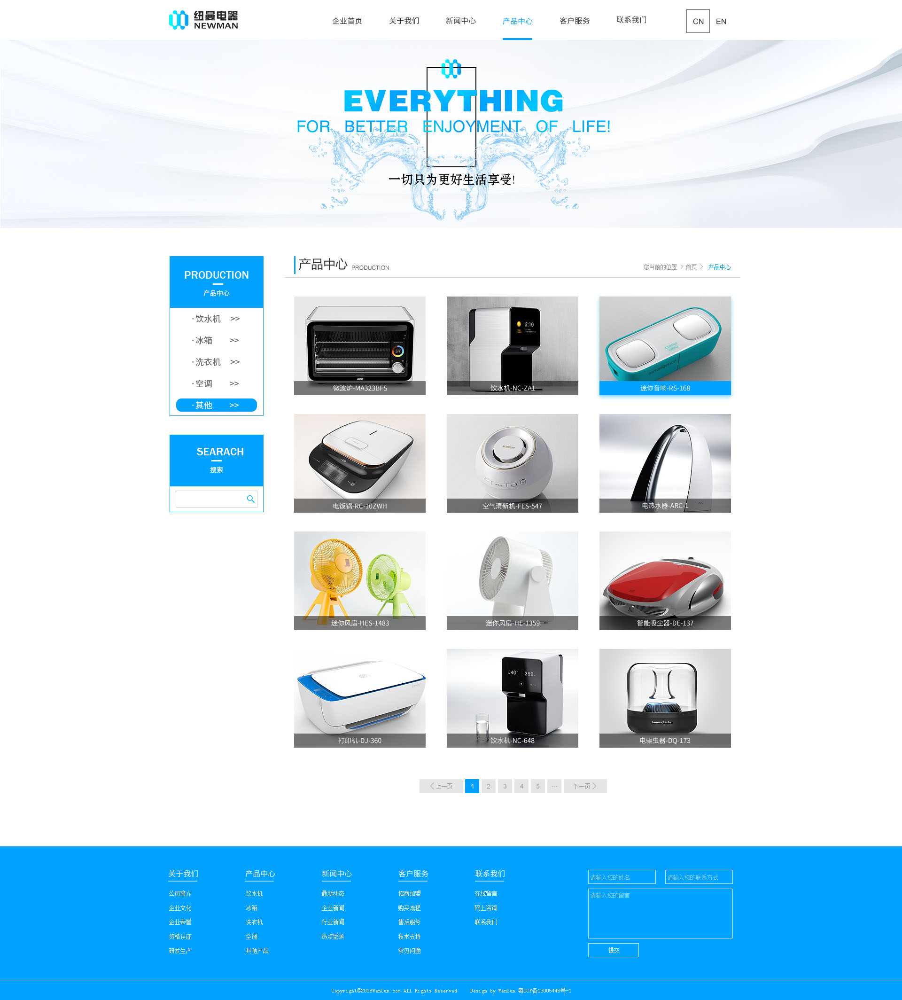
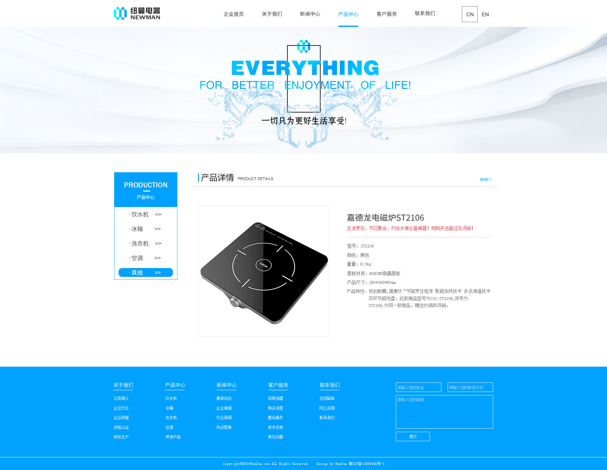
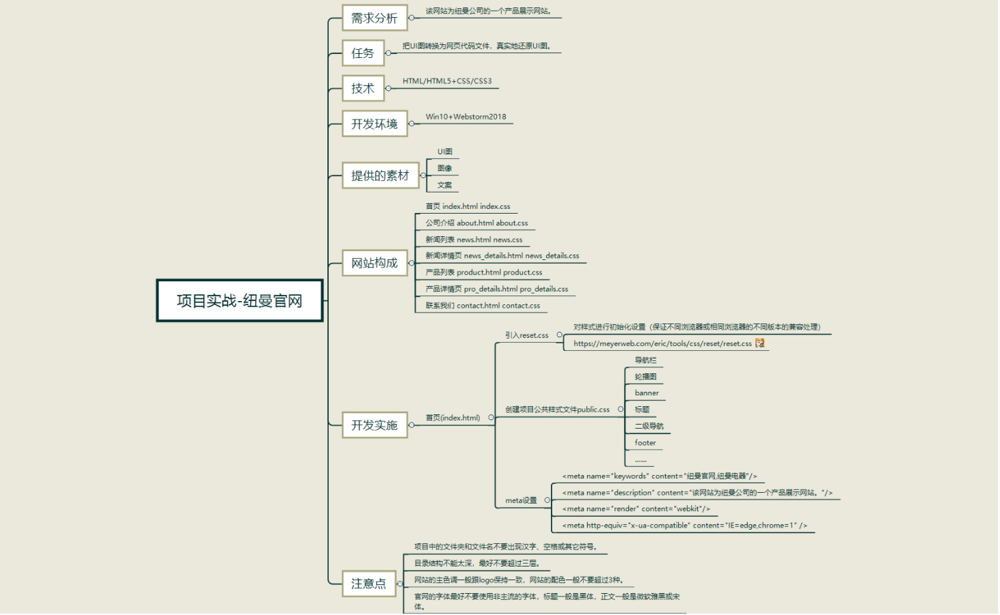
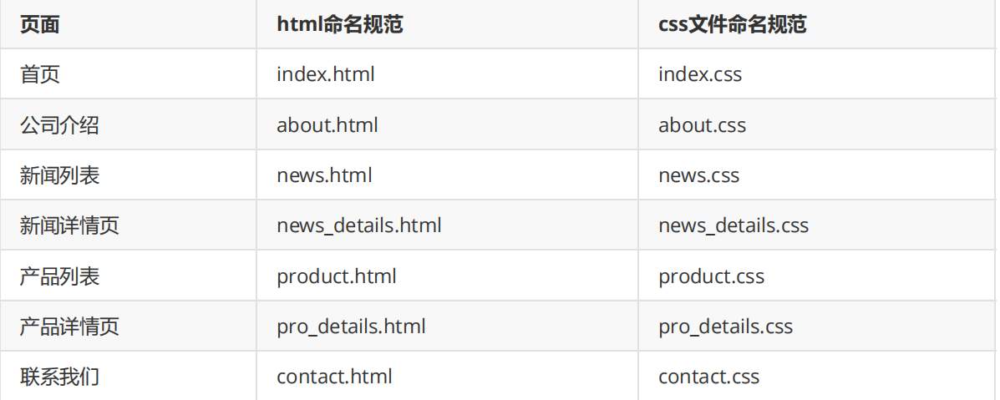
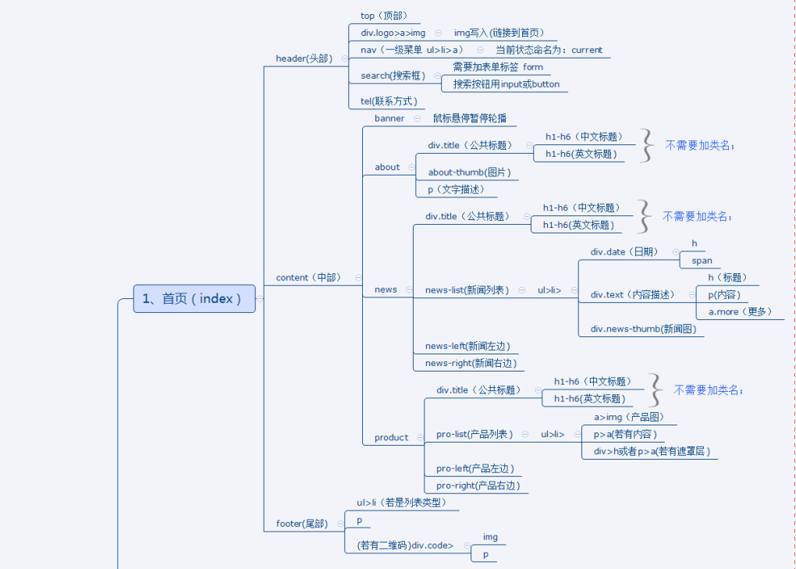
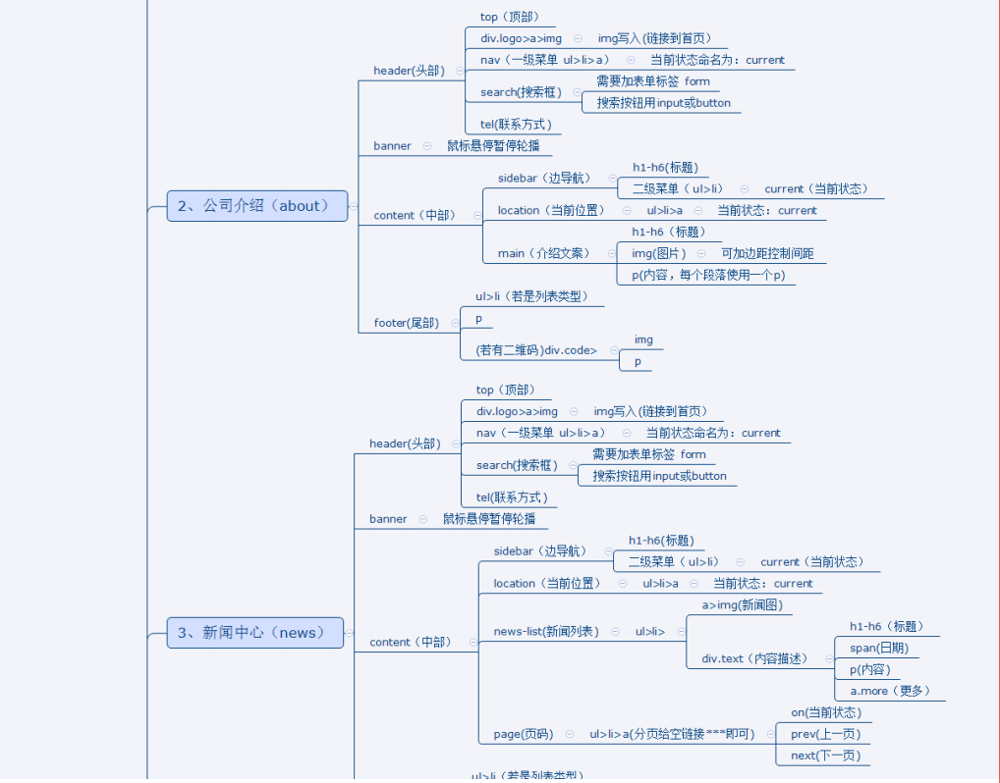
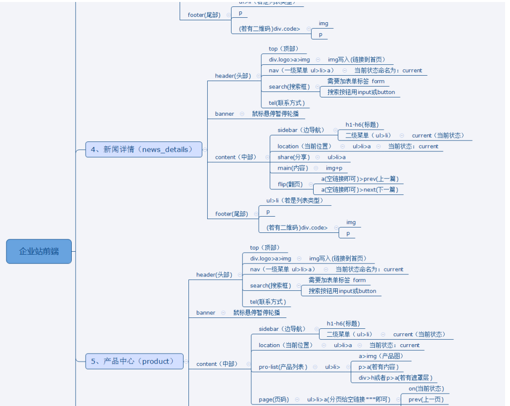
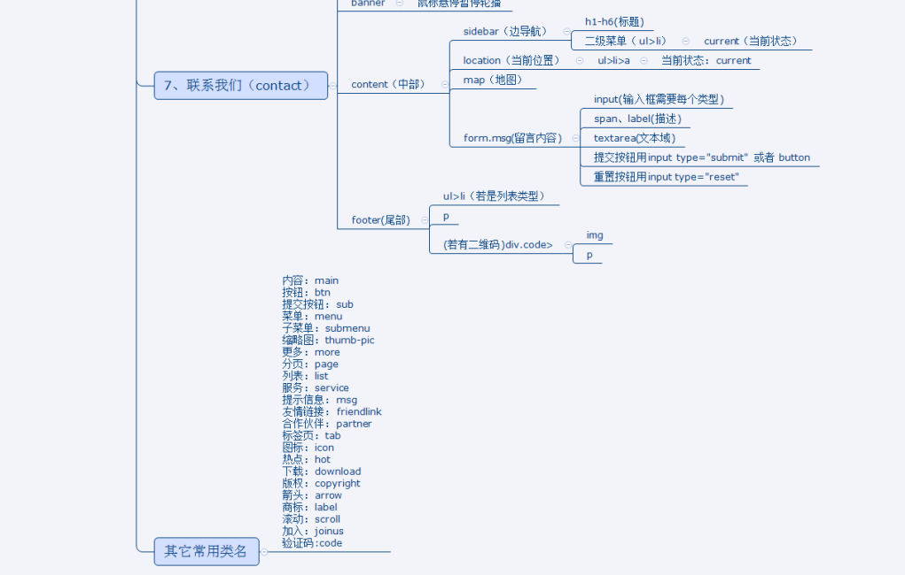

# newman
 静态html网页-纽曼官网

## 界面展示
[静态展示](https://1941289645.github.io/newman/)










……

## 思维导图



## 设计图分析



**公共样式：**

 public.css 或者 main.css 等

**全局样式：**

```css
/*全局样式开始*/
body{padding: 0;margin: 0;font-family: "微软雅黑";font-size: 12px;background: #ffffff;}
ul,li,a,h2,h3,h4,h5,h6,form,p,div{padding: 0;margin: 0;}
ul{list-style: none;}
img{border: 0;}
a{text-decoration: none;}
.clearfloat{clear: both;height: 0;font-size: 1px;line-height: 0;}
/*图片自适应*/
img{border:0;max-width:100%;height:auto;height:auto\9;display:block;}
/*解决ie/firefox 浏览器中，点击一个链接后有一个虚线边框的问题*/
a{blr:expression(this.onFocus=this.close());} /* 只支持IE，过多使用效率低 */ 
a{blr:expression(this.onFocus=this.blur());} /* 只支持IE，过多使用效率低 */ 
a:focus { -moz-outline-style: none; } /* IE不支持 */ 
a:focus {outline:none; -moz-outline:none;}
a:active{background:none;}
/*解决chrome 浏览器，当文本框，多行文本获得焦点的时候，会有一个边框的问题*/
input,textarea{outline:none;}
/*全局样式结束*/
```

**样式命名规范：**









